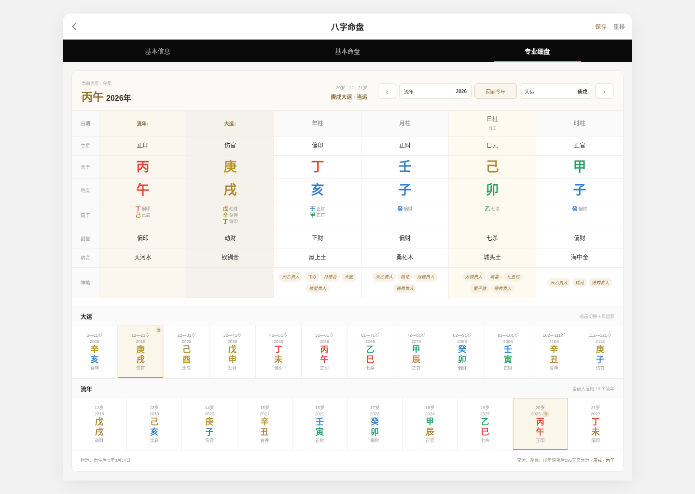

# 真一八字排盘 · ZhenYi Bazi Paipan

> **传统师承 · 十余年线下命理实务 · TypeScript 开源八字排盘系统**

[](https://www.zhenyi.org/)
[](#-快速开始)


🌐 **在线体验：<https://www.zhenyi.org/>**

**真一八字排盘**是一套面向真实命理工作场景开发的开源排盘系统。

项目发起者有传统师承，长期从事线下命理工作与实际命盘分析。十余年的实务经历，让我们更关注一套排盘工具真正长期使用时的几个基础问题：**历法口径是否清楚、出生时间处理是否完整、排盘信息是否够专业、操作是否足够高效。**

因此，我们把日常工作中高频使用的排盘能力整理成一套独立、轻量、可部署、可二次开发的 TypeScript 项目。

> **传统术数很古老，但它的工具不应该停留在过去。**

---

## ✨ 核心能力

### 🌞 真太阳时排盘

根据出生日期、北京时间与出生地经度自动计算真太阳时，并将修正后的年月日时分**真正用于四柱计算**。

支持：

- 出生地经度修正
- 均时差修正
- 真太阳时实时预览
- 跨时辰处理
- 跨日处理

不是只在页面上显示一个“真太阳时”。

---

### 📍 全国省 / 市 / 区县三级出生地

内置中国省、市、区县行政区划与经纬度数据：

- 省 / 自治区 / 直辖市
- 地级市 / 州 / 盟 / 地区
- 区 / 县 / 县级市
- 区县关键词搜索
- 选择地区后自动带入经纬度
- 本地数据运行，不依赖地图 API Key

示例：

> **浙江省 → 杭州市 → 余杭区**

数据来源及版本说明见 [`docs/DATA_SOURCES.md`](docs/DATA_SOURCES.md)。

---

### 🧭 专业八字排盘

当前开源版本已实现：

- 公历 / 农历 / 闰月排盘
- 二十四节气
- 年柱 / 月柱 / 日柱 / 时柱
- 真太阳时
- 十神
- 藏干 / 副星
- 十二长生
- 纳音
- 旬空
- 胎元 / 命宫 / 身宫 / 胎息
- 起运 / 交运
- 12 步大运
- 120 流年
- 小运
- 五行统计与评分
- 日主强弱参考
- 神煞系统

结果页按照实际使用场景划分为：

**基本信息 / 基本命盘 / 专业细盘**

专业细盘支持大运、流年联动查看，以及上一年、下一年、回到今年等操作。

---

## 🧿 200+ 神煞判定项

神煞不是写死在页面上的静态文字，而是由独立的结构化规则引擎进行匹配。

当前规则体系包含：

- **200+ 神煞判定项 / 场景**
- **59 类神煞名称**
- **78 条结构化基础规则**
- **300+ 规则匹配路径**
- 覆盖 **原命局 + 12 步大运 + 120 流年**

已实现的代表性神煞包括：

| 类别 | 示例 |
|---|---|
| 贵人 / 禄名 | 天乙贵人、太极贵人、文昌贵人、国印贵人、福星贵人、天德贵人、月德贵人、德秀贵人、天厨贵人、金舆、禄神 |
| 学业 / 文名 | 学堂、正学堂、词馆、正词馆、三奇贵人、六秀日、十灵日 |
| 桃花 / 婚恋 | 桃花、红鸾、天喜、红艳煞、孤鸾煞、阴差阳错、九丑日、孤辰、寡宿 |
| 行动 / 权势 | 驿马、将星、华盖、羊刃、飞刃、魁罡日、金神 |
| 灾煞 / 刑伤 | 劫煞、亡神、灾煞、血刃、流霞、元辰、勾绞煞、天罗、地网、四废日、十恶大败 |
| 其他 | 披麻、吊客、丧门、童子煞、天赦日、天转日、地转日、八专日、拱禄等 |

完整说明见 [`docs/SHENSHA.md`](docs/SHENSHA.md)。

> 不同流派对于神煞的取法和使用权重存在差异。本项目将规则结构化，便于检查、讨论与扩展。

---

## 📱 Mobile + PC 自适应

### 移动端

- 紧凑排盘表单
- 年 / 月 / 日 / 时 / 分滚轮选择
- 公历 / 农历切换
- 省 / 市 / 区县三级选择
- 真太阳时实时预览
- 大运 / 流年横向操作
- 高密度命盘展示

### PC 端

- 宽屏专业工作区
- 首页双栏布局
- 基本信息分栏展示
- 四柱专业表格
- 流年 / 大运 / 原局分区
- 大运、流年宽屏展示
- 支持键盘 `← / →` 切换流年

### 页面预览

**移动端排盘**


**PC 基本命盘**


**PC 专业细盘**



---

## 💾 命盘保存

支持在浏览器本地保存常用命盘：

- 姓名
- 性别
- 历法
- 出生日期与时间
- 出生地区
- 经纬度
- 分组

保存后可以直接载入重新排盘。

当前开源版使用 `localStorage`，无需数据库。

---

## 🔓 开源内容

本仓库完整包含：

- 八字排盘核心
- 公历 / 农历 / 闰月转换
- 二十四节气
- 真太阳时计算
- 四柱 / 十神 / 藏干 / 纳音 / 旬空
- 胎元 / 命宫 / 身宫 / 胎息
- 起运 / 大运 / 流年 / 小运
- 五行数据与评分
- 神煞规则引擎及规则数据
- 全国省市区县与经纬度数据
- 移动端 / PC 排盘 UI
- 本地命盘保存
- TypeScript API

---

## 🔒 未包含的部分

以下属于**真一线上平台、商业产品及师门专业体系**，不在本次开源范围内：

- **AI 命理解读 Prompt**：结合长期实务经验、师门方法与真一内部命理解读体系调校的提示词与工作流
- **专业命理解读体系**：师门理法、做功取象、直断方法、案例经验及内部规则体系
- **AI 报告系统**：事业、财富、婚恋、健康、流年等完整报告生成链路
- **商业后端 API**：线上产品使用的业务接口、报告服务与内部服务编排
- **用户系统**：登录、短信验证、账号、会员、权益、支付等
- **云端命盘库**：用户命盘同步、分组、历史记录与云端存储
- **内部知识库**：师门资料、长期案例、专业术数资料及内部数据
- **服务端安全**：签名校验、防刷、风控、限流、密钥与安全策略
- **部署与运营配置**：Nginx、数据库、云服务、监控、日志及正式环境配置

本次开源的定位很明确：

> **开放专业排盘基础设施，不开放师门核心技法与商业平台能力。**

如果你只需要一套可靠、完整、方便二次开发的八字排盘底座，这个仓库可以直接使用。

---

## 👤 关于真一

真一不是从“做一个命理网站”开始的。

项目背后是长期的线下命理工作与传统师承经历。我们真正关心的，从来不只是软件能不能排出八个字，而是**传统方法如何在今天仍然能够被准确地使用，专业经验如何通过现代技术转化成更稳定、更易用的工具。**

师门中的很多方法，本来依赖口传心授、长期实践和大量案例才能逐渐掌握。技术并不能替代这些经验，但它可以把基础计算、资料组织、规则调用和工作流程做得更好，让专业人士把注意力放回真正重要的判断上。

所以真一选择把**基础排盘能力开源**。

排盘可以透明，算法可以讨论，工程可以共同完善；而真正需要长期实践形成的理法、经验和判断体系，我们仍然保持应有的专业边界。

🌐 **真一官网：<https://www.zhenyi.org/>**

---

## ⚙️ 技术栈

| 层 | 技术 |
|---|---|
| 核心语言 | TypeScript |
| 运行环境 | Node.js 20+ |
| HTTP 服务 | Node.js 原生 HTTP |
| 前端 | HTML / CSS / JavaScript |
| 地区数据 | 本地静态数据 |
| 运行时第三方 npm 依赖 | **0** |

---

## 🚀 快速开始

### 直接运行

```bash
node dist/server.js
```

默认访问：

```text
http://localhost:8787
```

### 修改源码

```bash
npm install
npm run build
npm test
npm start
```

Node.js：**20+**

---

## 🔌 API

核心接口：

```text
POST /api/paipan
```

示例：

```json
{
  "name": "命例一",
  "birthday": "1990-06-15",
  "birth_time": "12:00",
  "gender": "male",
  "is_lunar": 0,
  "is_leap": 0,
  "longitude": 120.306592,
  "birth_region": "浙江省杭州市余杭区"
}
```

详细说明见 [`docs/API.md`](docs/API.md)。

---

## 📂 项目结构

```text
.
├── public/                 # 排盘页面与静态资源
├── src/
│   ├── core/               # 四柱、历法、真太阳时、神煞等核心
│   ├── data/               # 均时差与神煞规则
│   ├── api.ts
│   └── server.ts
├── dist/                   # 编译产物
├── tests/                  # 测试
├── docs/                   # API / 架构 / 数据 / 神煞说明
├── .github/                # GitHub Actions / Issue 模板
├── LICENSE
└── README.md
```

---

## 💡 为什么开源？

我们愿意把基础排盘开放出来，是因为排盘本身应该尽可能透明。

开发者可以阅读实现，命理从业者可以核对规则，不同体系之间也可以基于清楚的代码讨论差异，而不是永远依赖无法解释的黑箱结果。

**开源基础能力，保留专业方法；让传统术数与现代工程各自发挥真正的价值。**

---

## 🛣️ Roadmap

- [ ] 命盘资料库独立页面
- [ ] 分组 / 搜索 / 备注
- [ ] 命盘分享
- [ ] PNG / PDF 导出
- [ ] Docker 部署
- [ ] API 文档增强
- [ ] 更多排盘细节与规则扩展

---

## 🤝 参与贡献

欢迎命理从业者、传统文化研究者和开发者参与。

如果发现排盘差异，建议提交 Issue，并尽量提供：

- 出生日期与时间
- 公历 / 农历
- 是否闰月
- 出生地点 / 经度
- 性别
- 你认为正确的结果
- 对应理论依据或可复核来源

详见 [`CONTRIBUTING.md`](CONTRIBUTING.md)。

---

## ⚠️ 免责声明

本项目用于传统文化、民俗文化、历法研究及软件工程交流。

不同命理流派存在不同理论口径与使用方法。项目内容不构成医疗、法律、金融、投资等专业意见，也不应作为重大现实决策的唯一依据。

---

## 📜 License

代码采用 [MIT License](LICENSE)。

行政区划数据包含第三方开源数据整理结果，请同时阅读 [`THIRD_PARTY_NOTICES.md`](THIRD_PARTY_NOTICES.md) 与 [`docs/DATA_SOURCES.md`](docs/DATA_SOURCES.md)。

---

## ⭐ Star

如果这个项目对你有帮助，欢迎点一个 **Star**。

也欢迎提交 Issue / Pull Request，一起完善这个项目。

**传统术数很古老，但它的工具不应该停留在过去。**
