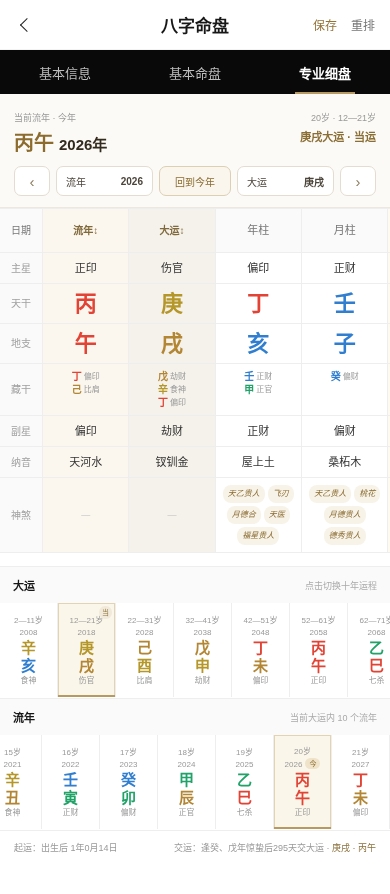

# 真一八字排盘 · ZhenYi Bazi Paipan

> **十年命理从业实践 × TypeScript 工程化实现**  
> 一个面向真实命理工作场景打造的开源八字排盘系统。


**真一八字排盘**并不是一个只为了“排出八个字”的演示项目。

这个项目来自长期的一线命理工作需求。过去十年，在实际排盘、复盘和使用不同工具的过程中，我越来越确定：一个专业排盘系统真正重要的，不是界面堆了多少功能，而是**历法口径是否明确、时间修正是否严谨、边界情况是否稳定、命盘信息是否完整，以及结果能不能经得起重复验证**。

因此，我们把排盘核心完整迁移为 TypeScript，并围绕真实使用场景重新设计了移动端与 PC 端交互，希望提供一套**透明、可验证、可二次开发、适合专业工作流**的八字排盘基础设施。

> **传统术数很古老，但它的工具不应该停留在过去。**

---

## ✨ 核心能力

### 🌞 真太阳时：不是只显示，而是真正进入四柱计算

系统根据出生日期、北京时间与出生地经度计算真太阳时：

1. 出生地经度相对东八区中央经线（东经 120°）的地方时差修正
2. 当日均时差（Equation of Time）修正
3. 得到修正后的真太阳时
4. **使用修正后的年月日时分重新进入四柱排盘核心**

因此，如果真太阳时发生跨时辰甚至跨日，四柱会按修正后的时间重新计算，而不是只在界面上显示一个“真太阳时”。

专项回归样本已经覆盖向前跨日、向后跨日、23 点附近、午夜附近以及不同经度场景。

---

### 📍 全国省 / 市 / 区县三级出生地

内置本地行政区划与区县经纬度数据，支持：

- 省 / 自治区 / 直辖市
- 地级市 / 州 / 盟 / 地区
- 区 / 县 / 县级市
- 区县关键词搜索
- 选择地区后自动带入经纬度
- 不依赖百度、高德等在线地图 API Key

例如：

> **浙江省 → 杭州市 → 余杭区**

地区数据打包在前端静态资源中，可离线部署。数据来源及版本说明见 [`docs/DATA_SOURCES.md`](docs/DATA_SOURCES.md)。

---

### 🧭 完整八字排盘

当前开源版本已经实现：

- 公历排盘
- 农历排盘
- 农历闰月
- 二十四节气
- 年柱 / 月柱 / 日柱 / 时柱
- 真太阳时
- 十神
- 藏干 / 副星
- 十二长生
- 纳音
- 旬空
- 胎元
- 命宫
- 身宫
- 胎息
- 起运时间
- 交运时间
- 12 步大运
- 120 流年数据
- 小运
- 五行统计
- 五行评分
- 日主强弱参考
- 神煞系统

排盘结果按实际工作习惯分为：

**基本信息 / 基本命盘 / 专业细盘**

专业细盘支持大运与流年联动、上一年 / 下一年、回到今年、直接选择大运与流年，并在 PC 端提供更高密度的专业展示。

---

## 🧿 神煞系统：200+ 判定项，完整贯穿命局 / 大运 / 流年

项目的神煞不是写死在页面里的静态标签，而是一个独立的结构化规则匹配系统。

当前规则库包含：

- **59 类神煞名称**
- **78 条结构化基础规则**
- 按年、月、日、时、大运、流年及目标柱展开后形成 **300+ 匹配路径**
- 完整计算链路覆盖 **主命局 + 12 步大运 + 120 流年**
- 对外可以理解为 **200+ 神煞判定项 / 场景**

代表性神煞包括：

| 类别 | 已实现示例 |
|---|---|
| 贵人 / 禄名 | 天乙贵人、太极贵人、文昌贵人、国印贵人、福星贵人、天德贵人、月德贵人、天德合、月德合、德秀贵人、天厨贵人、金舆、禄神 |
| 学业 / 文名 | 学堂、正学堂、词馆、正词馆、三奇贵人、六秀日、十灵日 |
| 桃花 / 婚恋 | 桃花、红鸾、天喜、红艳煞、孤鸾煞、阴差阳错、九丑日、孤辰、寡宿 |
| 行动 / 权势 | 驿马、将星、华盖、羊刃、飞刃、魁罡日、金神 |
| 灾煞 / 刑伤 | 劫煞、亡神、灾煞、血刃、流霞、元辰、勾绞煞、天罗、地网、天罗地网、四废日、十恶大败 |
| 丧服 / 其他 | 披麻、吊客、丧门、童子煞、天赦日、天转日、地转日、八专日、拱禄等 |

完整规则说明见 [`docs/SHENSHA.md`](docs/SHENSHA.md)。

> 不同命理体系对神煞的取法、优先级和使用方式可能存在差异。本项目将规则结构化，目的之一就是让每条规则可以被检查、讨论和修正，而不是隐藏在黑箱里。

---

## 📱 Mobile + PC 自适应

这不是简单把手机页面放大到电脑。

### 移动端

- 紧凑的排盘表单
- 年 / 月 / 日 / 时 / 分滚轮选择
- 公历 / 农历切换
- 全国省市区县三级选择
- 真太阳时实时预览
- 高密度四柱命盘
- 大运 / 流年横向滑动
- 适合手机现场排盘

### PC 端

- 宽屏专业工作区
- 首页左右双栏
- 基本信息双栏展示
- 四柱高密度表格
- 流年 / 大运 / 原局分区
- 12 步大运与 10 个流年充分利用横向空间
- 支持键盘 `← / →` 切换流年

### 页面预览

**移动端排盘**


**PC 基本命盘**


**PC 专业细盘**


**移动端专业细盘**



---

## 💾 命盘保存

当前版本支持在浏览器本地保存命盘资料：

- 姓名
- 性别
- 历法
- 出生日期
- 出生时间
- 出生地区
- 区县代码
- 经纬度
- 分组

保存后可直接载入重新排盘，也可删除。

当前使用 `localStorage`，无需数据库。它适合独立工具与本地部署；如果后续接入登录系统，可平滑扩展为 MySQL / PostgreSQL 云端命盘库。

---

## 🧪 严格迁移与回归验证

本项目最初由 PHP 排盘核心迁移而来。迁移时没有采用“能运行就算完成”的方式，而是把旧 PHP 作为基准，使用同一输入分别运行 PHP 与 TypeScript，递归比较完整结果对象。

### 已完成验证

- **300 组 PHP → TypeScript 全字段对拍：300 / 300 一致**
- 覆盖 1950–2035 不同年份与月份
- 男女样本
- 多个分钟边界
- 0 点 / 23 点附近
- 73.5°–134.8°不同经度
- 节气附近
- 普通农历
- 闰月
- 真太阳时跨日
- 完整神煞路径

参与比较的字段包括：

四柱、十神、藏干、五行、纳音、旬空、自坐、星运、真太阳时、节气、胎元、命宫、身宫、胎息、起运、交运、12 步大运、120 流年、小运、五行评分、日主强弱以及神煞等。

仓库同时保留关键回归向量：

```bash
npm test
```

详见 [`docs/TESTING.md`](docs/TESTING.md)。

> **对拍一致代表迁移前后算法行为一致，不等于宣称任何命理理论具有“绝对正确”的唯一答案。** 对传统术数项目而言，规则透明、口径明确、结果稳定、可复现，比“绝对准确”的宣传更重要。

---

## ⚙️ 技术栈

| 层 | 技术 |
|---|---|
| 核心语言 | TypeScript |
| 运行环境 | Node.js 20+ |
| HTTP 服务 | Node.js 原生 HTTP |
| 前端 | HTML / CSS / JavaScript |
| 地区数据 | 本地静态数据 |
| 运行时第三方 npm 依赖 | **0** |
| 开发依赖 | TypeScript |

之所以暂时没有引入大型后端框架，是为了让排盘核心尽可能轻量、可移植、易于审计。以后如果需要接 Fastify、NestJS、Express 或其他服务框架，只需要替换服务层，核心排盘模块无需重写。

---

## 🚀 快速开始

### 方式一：直接运行编译版本

仓库已经包含 `dist/`：

```bash
node dist/server.js
```

默认：

```text
http://localhost:8787
```

指定端口：

```bash
PORT=8080 node dist/server.js
```

### 方式二：修改 TypeScript 源码

```bash
npm install
npm run build
npm test
npm start
```

Node.js 要求：**20+**。

---

## 🔌 API

核心接口：

```text
POST /api/paipan
```

示例请求：

```json
{
  "name": "命例一",
  "birthday": "1990-06-15",
  "birth_time": "12:00",
  "gender": "male",
  "is_lunar": 0,
  "is_leap": 0,
  "longitude": 120.306592,
  "birth_region": "浙江省杭州市余杭区"
}
```

兼容历史路径：

```text
POST /api.php
```

该兼容地址内部仍然调用 TypeScript 核心，项目本身已经**不依赖 PHP**。

接口说明见 [`docs/API.md`](docs/API.md)。

---

## 📂 项目结构

```text
.
├── public/
│   ├── index.html                  # 排盘首页
│   ├── result.html                 # 独立结果页
│   └── assets/
│       └── china-regions.js        # 全国省 / 市 / 区县及经纬度
│
├── src/
│   ├── api.ts                      # 排盘 API
│   ├── server.ts                   # Node HTTP Server
│   ├── core/
│   │   ├── LocalPaipan.ts          # 历法、四柱、节气、起运、大运核心
│   │   ├── LocalChartAdapter.ts    # 统一命盘数据结构
│   │   ├── TrueSolarTimeCalculator.ts
│   │   ├── ShenShaMatcher.ts       # 神煞规则匹配引擎
│   │   └── WuXingScorer.ts         # 五行评分
│   └── data/
│       ├── eot.json                # 均时差数据
│       └── shensha-rules.json      # 神煞结构化规则
│
├── dist/                           # 已编译 JS，可直接运行
├── tests/                          # 回归测试与测试向量
├── docs/                           # API / 架构 / 数据 / 神煞 / 测试说明
├── .github/                        # GitHub Actions 与 Issue 模板
├── CONTRIBUTING.md
├── CHANGELOG.md
├── LICENSE
└── README.md
```

架构说明见 [`docs/ARCHITECTURE.md`](docs/ARCHITECTURE.md)。

---

## 🔓 开源范围

### 本仓库包含

- 八字排盘核心
- 公历 / 农历 / 闰月处理
- 二十四节气
- 真太阳时
- 起运 / 大运 / 流年
- 五行与十神相关数据
- 神煞匹配引擎与规则数据
- 全国省市区县选择与经纬度数据
- 移动端 / PC 排盘 UI
- 命盘本地保存
- 回归测试

### 当前不包含

- AI 命理解读 Prompt
- 付费报告系统
- 用户登录 / 会员 / 支付
- 云端命盘同步
- 商业运营后台
- 私有命理知识库

开源的是**排盘基础设施**。真正的命理解读深度、理法体系、经验判断以及具体产品能力，可以在此基础上继续构建。

---

## 💡 为什么开源？

我从事命理相关工作已有十年。

这些年的实际工作让我越来越清楚：传统命理并不缺“结论”，真正稀缺的是**能够被清楚表达、重复计算、交叉验证和持续修正的工具**。

如果基础排盘永远被封装在黑箱里，那么学习者无法理解计算过程，开发者无法检查边界，命理从业者也很难讨论不同软件之间为什么会出现结果差异。

所以我愿意把基础排盘能力开放出来。

让开发者能直接阅读代码；让命理从业者能够复核结果；让研究者能清楚知道某一个结论究竟来自哪一条规则。

我们相信：

> **排盘算法应该透明，命理判断应该有体系，软件工程应该允许验证。**

真正形成长期价值的，不只是“把八个字排出来”，而是对理法的理解、长期实践经验、判断能力、产品体验，以及传统术数与现代技术如何真正结合。

---

## 🛣️ Roadmap

- [ ] 万级随机命盘回归测试
- [ ] 更细的节气交接边界测试
- [ ] 更完整的神煞规则库
- [ ] 命盘资料库独立页面
- [ ] 分组 / 搜索 / 备注
- [ ] 命盘分享
- [ ] PNG / PDF 导出
- [ ] Docker 部署
- [ ] REST API 文档增强
- [ ] 云端命盘同步示例
- [ ] 紫微斗数模块
- [ ] 六爻模块
- [ ] 奇门遁甲模块

---

## 🤝 参与贡献

欢迎命理从业者、传统文化研究者、前后端开发者、算法工程师以及对历法感兴趣的朋友参与。

如果发现排盘差异，请尽量同时提供：

- 出生日期
- 出生时间
- 公历 / 农历
- 是否闰月
- 出生地点 / 经度
- 性别
- 你认为正确的结果
- 理论依据或可复核来源

这样更容易判断究竟是代码 Bug、历法口径差异，还是不同门派的规则差异。

详细说明见 [`CONTRIBUTING.md`](CONTRIBUTING.md)。

---

## ⚠️ 免责声明

本项目用于传统文化、民俗文化、历法与软件工程研究及技术交流。

命理体系本身存在不同门派、不同理论口径和不同解释方式。项目输出不构成医疗、法律、金融、投资等专业意见，也不应作为重大现实决策的唯一依据。

---

## 📜 License

代码采用 [MIT License](LICENSE)。

行政区划数据包含来自第三方开源数据源的整理结果，请同时阅读 [`THIRD_PARTY_NOTICES.md`](THIRD_PARTY_NOTICES.md) 与 [`docs/DATA_SOURCES.md`](docs/DATA_SOURCES.md)。

---

## ⭐ Star

如果这个项目对你有帮助，欢迎点一个 **Star**。

如果你发现一个边界问题、一个规则差异，或者有更好的工程实现，也欢迎直接提交 Issue / Pull Request。

**传统术数很古老，但它的工具不应该停留在过去。**
